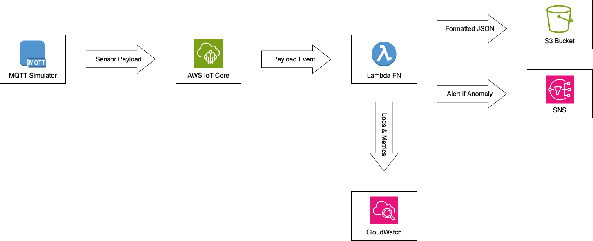

# Server Room Environmental Monitor

This is a cloud-native monitoring system that simulates environmental data from a server room and streams it to AWS for real-time processing and alerting. I designed this project to demonstrate my ability to build scalable, event-driven systems using core AWS services and Python.

## Purpose

This project is part of my broader effort to deepen my expertise in cloud engineering, with a focus on AWS infrastructure. I’m simulating the type of telemetry workflows used in edge monitoring or data center health systems—critical in high-availability environments like AWS EC2 or enterprise server fleets.

The system ingests sensor data (temperature, humidity, vibration), processes it via Lambda, stores logs in S3, and triggers alerts via SNS when anomalies are detected.

## Key AWS Services Used

- **AWS IoT Core** – MQTT broker for ingesting sensor telemetry
- **AWS Lambda** – Serverless compute to process and evaluate incoming data
- **Amazon S3** – Durable object storage for logs and alerts
- **Amazon SNS** – Push-based alerting mechanism (email/SMS)
- **AWS CloudWatch** – Metrics, logs, and observability (in progress)
- *(Optional)*: EC2, AWS Greengrass, Athena, QuickSight

## Architecture Diagram

## Roadmap

Phase 0 – Setup & Project Initialization
Set up the project structure, .gitignore, virtual environment, and config files. Connect the repo and prepare the dev environment.

Phase 1 – Sensor Simulator (Python)
Write a Python script to simulate temperature, humidity, and vibration data. This will send data periodically using MQTT.

Phase 2 – AWS IoT Ingestion
Set up AWS IoT Core to receive MQTT messages. Create rules to trigger processing.

Phase 3 – Event-Driven Processing & Alerts
Write a Lambda function to process incoming data, check for anomalies, and send alerts via SNS or log to S3.

Phase 4 – System Testing & Observability
Simulate both normal and abnormal sensor data. Use CloudWatch and logging to verify everything works correctly.

Phase 5 – Documentation & Architecture Diagrams
Write the final README, generate architecture visuals, and document how the system works.

Phase 6 – Extensions & Enhancements
Add optional improvements like ML-based anomaly detection, EC2 deployment, metrics visualization, or CI/CD.

---

I'll be iterating on this project in the open — if you're interested in seeing how I approach designing, structuring, and deploying cloud-first systems, feel free to follow along!

Notes during development:
To test MQTT client, subsribe to sensors/server-room/#.

As part of this simulation work, I am also considering potential scaling and architecture implications. While the initial implementation will use lightweight threading for parallel rack simulation, I am mindful of potential Lambda execution bottlenecks. If needed, I may explore buffering strategies like Amazon SQS or EventBridge, keeping cost (free-tier usage) and speed. CloudWatch metrics and throttling behavior will guide this decision. Though outside of my budget, Amazon Kinesis would be the next step up for increasing throughput.

Whenever changes are made to my local lambda/lambda_function, I run these commands to reflect the changes in my lambda_deploy folder.
For Local Testing:
`cp lambda/lambda_function.py lambda_deploy/lambda_function.py`

For Full Deployment to Lambda:
`rm lambda_payload.zip`
`zip -r lambda_payload.zip . -x "*.DS_Store" "**/__pycache__/*"`
