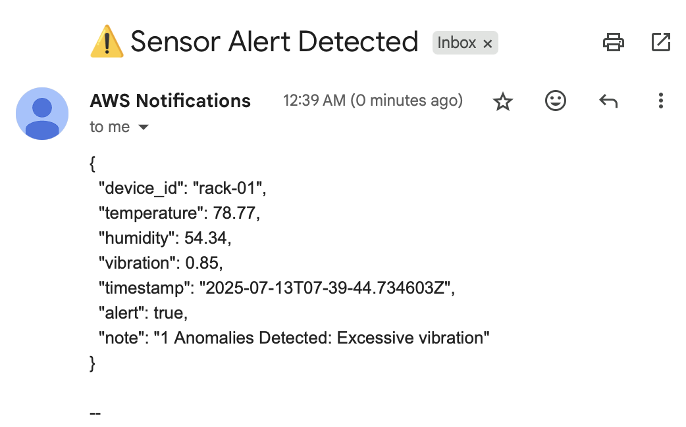

# ✅ Test Plan – Lambda Anomaly Detection System

This document outlines the test cases and outcomes for the server room monitoring Lambda function.

---

## 🧪 How to Run Tests
For full Unit Testing:
`python3 test/test_lambda_handler.py`

To Start Full Simulation and Pipeline:
`python3 simulator/simulate_sensors.py`

For One Rack — `device-id`, `min-interval`, `max-inteval`, `num-messages`
For Multiple Racks — `num-racks`, `min-interval`, `max-inteval`, `num-messages`

---

## 🔗 Log File
To Generate Log:
`python3 test/test_lambda_handler.py 2>&1 | tee test/test_output.log`

See [test_output.log](test_output.log) for full execution output.

---

## ✅ Test Matrix

| Test Case             | Description                                  | Expected Outcome                        | Actual Outcome                         |
|----------------------|----------------------------------------------|-----------------------------------------|----------------------------------------|
| [`valid_payload.json`](../test_inputs/valid_payload.json) | Normal payload, all fields valid             | Status 200, alert: false                | ✅ Passed                              |
| [`high_temp.json`](../test_inputs/high_temp.json)     | Temp > 90°F                                  | Status 200, alert: true                 | ✅ Passed                              |
| [`high_vibration.json`](../test_inputs/high_vibration.json)| Vibration > 0.7                              | Status 200, alert: true                 | ✅ Passed                              |
| [`low_humidity.json`](../test_inputs/low_humidity.json)  | Humidity < 20%                               | Status 200, alert: true                 | ✅ Passed                              |
| [`high_humidity.json`](../test_inputs/high_humidity.json) | Humidity > 70%                               | Status 200, alert: true                 | ✅ Passed                              |
| [`multi_anomaly.json`](../test_inputs/multi_anomaly.json) | Temp + vibration both abnormal               | Status 200, alert: true                 | ✅ Passed                              |
| [`edge_case_payload.json`](../test_inputs/edge_case_payload.json) | Values exactly at thresholds             | Status 200, alert: true (conservative threshold logic) | ✅ Passed |
| [`edge_humidity.json`](../test_inputs/edge_humidity.json) | Humidity = 20% (right on lower threshold)    | Status 200, alert: false                | ✅ Passed                              |
| [`malformed_payload.json`](../test_inputs/malformed_payload.json)| Invalid types (e.g., temp as string)      | Status 400, error: "Invalid data types" | ✅ Passed                              |
| [`missing_input.json`](../test_inputs/missing_input.json) | Missing humidity/timestamp fields            | Status 400, error: "Missing fields"     | ✅ Passed                              |

---

## 📌 Notes

- CloudWatch metrics for `LambdaExecutions` and `AnomaliesDetected` were emitted successfully for each valid call.
- SNS alert warnings were logged when `SNS_TOPIC_ARN` was unset (expected in local test).
- Payloads were written to S3 under correct folder structure for anomalies and invalid data.

- Example SNS alert screenshot:
  

- Anomaly logs are stored under: `alerts/device_id/timestamp.json`  
  Invalid payloads under: `invalid/device_id/timestamp.json`  
  All valid payloads under: `raw/device_id/timestamp.json`

- End-to-end validation also performed via AWS IoT MQTT test client to simulate production traffic.